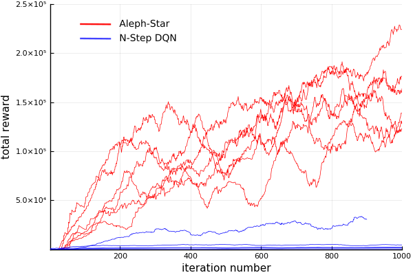

<div align="center">
  
</div>

This repository contains the necessary code to reproduce the results presented in [GTC 2018 (Israel)](https://www.nvidia.com/en-il/gtc/) talk and WIP paper "Reinforcement learning with A* and a deep heuristic". "Aleph-Star" is the main algorithm described in these presenations.

This repository is not yet in the form of a Julia package (this is WIP), but it is fairly general and can easily be used with different environments.

## Installation

1. clone this repository `git clone https://github.com/imagry/aleph_star`

2. Make sure you have [Julia 1.01](https://julialang.org/downloads/) or above installed

3. Install the following Julia packages:

```Julia
using Pkg
Pkg.add("DataStructures")
Pkg.add("Nullables")
Pkg.add("Dierckx")
Pkg.add("PyPlot")
Pkg.add("IJulia")
Pkg.add("Plots")
Pkg.add("Knet")
Pkg.add("JLD2")
Pkg.add("DSP")
```

Regarding the above packages:

on Linux `Dierckx` needs a fortran compiler so `sudo apt-get install gfortran`. The ML package is [Knet](https://github.com/denizyuret/Knet.jl) it requires `nvcc` (NVIDIA compiler from `Cuda`) to be in path, otherwise it will default to using the CPU thus requiring some minor modifications to the code. The `IJulia` package is only needed to use the Jupyter notebooks it requires a working `jupyter notebook` from the command line. The basic algorithm implementation (`aleph_zero` folder) uses only `DataStructures` and `Nullables` packages. `Dierckx` and `DSP` are used by the environment (described below), `PyPlot` and `Plots` are only used for interactive plotting of results, `JLD2` is for saving the results in `HDF5` format and `Knet` is used for ML.

## The environment

The only supplied environment is of a car following a lane. It can be found in the `env` directory, to include it call `include("env/env_lane.jl")`. This environment generates a lane of random width, curves and cars (with a random but smooth velocity profile). Curvature, min/max width and length can be configured, to use the defaults just call `state, env = initialize_simple_road()` which will generate a new random lane and an initial state. All units (velocity, acceleration, time are in `MKS`, angles in radians. The car uses [Ackermann steering](https://en.wikipedia.org/wiki/Ackermann_steering_geometry) in which the wheels are not allowed to slip. Sensors inputs can be generated from any state `sensors = get_sensors(env, state)` which in our case results in an 84x84 `UInt8` grayscale-pixels image (just like the original DQN sensors) which can then be plotted by (for e.g.) `heatmap(sensors, aspect_ratio=1.0)` resulting in:
<div align="center">
  
</div>

### Regarding the sensors:

instead of using multiple images (like in the original DQN paper), we encode additional information in the image itself: the background color maps to car velocity, the current steering is encoded in values of the the pixels to the left and to the right of the orange lines (which are themselfs of constant color), and the relative velocity between our car and others populating the lane (aka `yolocars` in the code) is encoded in the pixels of the yolocars. The sensors are relative to the car which is drawn as a triangle at the bottom center of the image (this triangle is of constant shape and position, the color is as the background).

### Simulating a few steps

The function `state, reward, done = sim!(env, state, action)` will simulate by default 5 steps and return the new state, a positive reward and done (whether the car crashed or not). The action is composed of continuous steering and acceleration `action = (steer, accel)`. The values are discretized with an index `action = action_ix_to_action(env, ix)` the steering (of the wheels not steering wheel) has `actionc_steer == 7` equally sized steps ranging from `-MAXSTEER` to `MAXSTEER == pi/30` this roughly corresponds to a 90 degree turn of the steering wheel. The acceleration has `actionc_accel == 5` equally sized steps ranging from `-MAXACCEL` to `MAXACCEL == 4.0` in `m/s^2`, (accelerating from 0 to 100Mph at 4 m/s^2 takes 9 seconds, like any family car). `done` is true when the car gets too close to a `yolocar`, when it speed above the maximum allowed `MAXSPEED == 14 m/s` (50 Kmph or 30 Mph) or when it reverses at more than `MINSPEED == -0.9 m/s`. When the car overtakes a yolocar the yolocar is re-spawned randomly at about ~60 meters in front of our car. The reward is proportional to the velocity, position and angle of the car on the lane preferring low angles, central position and high velocity. A small "keep alive" reward is given regardles of the car dynamical parameters.

### Training with Aleph-Star and n-step DQN

1. create a 

### Results


<div align="center">
  
</div>

### Creating a new environment


