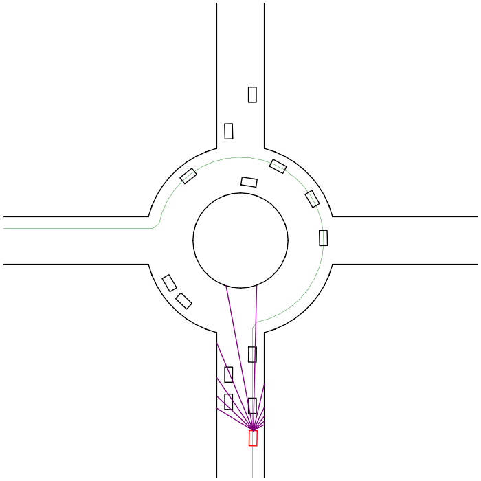
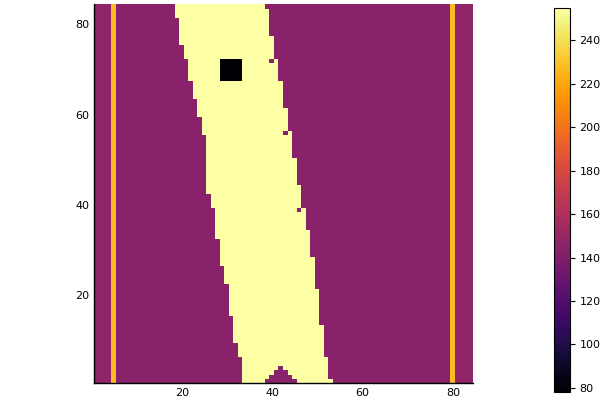
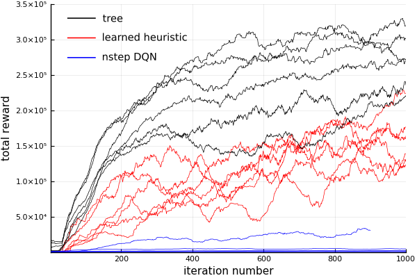
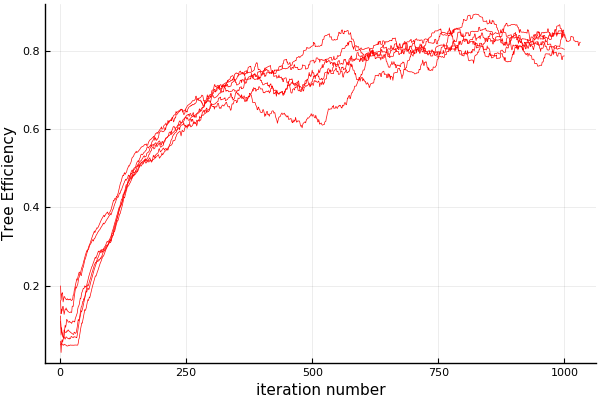

<div align="center">
  
</div>

This repository contains the necessary code to reproduce the results presented in [GTC (Israel) 2018](https://www.nvidia.com/en-il/gtc/) talk and WIP paper "Reinforcement learning with A* and a deep heuristic". Aleph-Star is the main algorithm described in these presenations.

This repository is not yet in the form of a Julia package (this is WIP), but it is fairly general and can easily be used with different environments.

see the GTC presentation in PDF formate [here](GTC_PRESENTATION_NO_VIDEOS.pdf)
the libre office format with videos [GTC_PRESENTATION_WITH_VIDEOS.pdf]

## Table of contents

   * [What is Aleph-Star?](#what-is-aleph-star)
   * [What can it do?](#what-can-it-do)
   * [Installation](#installation)
   * [Simulated environment](#the-environment)
   * [Sensors](#regarding-the-sensors)
   * [Simulating a few steps](#simulating-a-few-steps)
   * [Training with Aleph-Star and n-step DQN](#training-with-aleph-star-and-n-step-dqn)
   * [Results](#results)
   * [Creating a new environment](#creating-a-new-environment)
   * [Why Julia?](#why-julia)
   * [Future development](#future-development)

## What is Aleph-Star?

It is an [A*-like](https://en.wikipedia.org/wiki/A*_search_algorithm) algorithm but using a learnable heuristic. The paper explaining it in detail is still WIP, but hopefully the documentaiton and code in this repository are a good start. Here is a short introduction: the problem of finding the minimal cost path between two nodes on a graph can be formulated as a decision process where at every visited node an optimal action has to be taken minimizing the total accumulated cost. Replacing cost by reward, any such algorithm that generates cost minimizing actions generates reward maximizing actions thus becomming a candidate solver for Markov Decision Processes (MDPs). A* is such a cost minimization algorithm that takes advantage of domain knowledge in the form of a heuristic function; it is interesting because for certain conditions (admissablility and consistency of the heuristic) it converges to the optimal solution while visiting a minimal number of nodes, i.e. no other similar algorithm (equally informed) could perform better. No such proof exists for Monte Carlo Tree Search (MCTS). In Aleph-Star the rule-based heuristic of A* is replaced with a Convolutional Neural Network, the weights are learned in a Reinforcement Learning fashion by interacting with a simulated environment by taking actions, earning rewards and backpropagating action values `Q_a(S)` where `a` represents the action index and `S` the sensory input (itself a function of the state and the environment). The learned heuristic can be used in runtime by itself, or it can be used with the the Aleph-Star tree in a very efficient manner, with little branching. Regular methods used in Q-Learining can be applied to Aleph-Star too, for e.g. reward for exploration, smart reward clipping, target network, etc.

## What can it do?

Motion planning, general model-based reinforcement learning. Stuff like this:



## Installation

1. clone this repository `git clone https://github.com/imagry/aleph_star`

2. Make sure you have [Julia 1.01](https://julialang.org/downloads/) or above installed

3. Install the following Julia packages:

```Julia
using Pkg
Pkg.add("DataStructures")
Pkg.add("LaTeXStrings")
Pkg.add("Nullables")
Pkg.add("Dierckx")
Pkg.add("PyCall")
Pkg.add("PyPlot")
Pkg.add("IJulia")
Pkg.add("Plots")
Pkg.add("Knet")
Pkg.add("JLD2")
Pkg.add("DSP")
```

Regarding the above packages:

on Linux `Dierckx` needs a fortran compiler so `sudo apt-get install gfortran`. The ML package is [Knet](https://github.com/denizyuret/Knet.jl) it requires `nvcc` (NVIDIA compiler from `Cuda`) to be in path, otherwise it will default to using the CPU thus requiring some minor modifications to the code. The `IJulia` package is only needed to use the Jupyter notebooks it requires a working `jupyter notebook` from the command line. The basic algorithm implementation (`aleph_zero` folder) uses only `DataStructures` and `Nullables` packages. `Dierckx` and `DSP` are used by the environment (described below), `PyPlot` and `Plots` are only used for interactive plotting of results, `JLD2` is for saving the results in `HDF5` format and `Knet` is used for ML.

4. The main scripts for reproducing the reults are the three Jupyter notebooks above `train_aleph.ipynb` for training aleph-star, `train_dqn.ipynb` for training N-Step DQN, and `plot_results.ipynb` for plotting the results.

## The environment

Import all the relevant functions and constants into the Julia environment:

```Julia
# this can take some time, especially the first time run:
import Statistics: median
using Test
using Plots
pyplot()
include("aleph_star/aleph_star.jl")
include("env/env_lane.jl")
include("ml/ml.jl")
include("ml/train_alephstar.jl");
include("ml/train_dqn.jl");
include("test.jl")
```

The only supplied environment is of a car following a lane. The relevant files are in the `env` folder. This environment generates a lane of random width, curves and cars (with a random but smooth velocity profile). Curvature, min/max width and length can be configured, to use the defaults just call `state, env = initialize_simple_road()` which will generate a new random lane and an initial state. All units (velocity, acceleration, time) are in `MKS`, angles in radians. The car uses [Ackermann steering](https://en.wikipedia.org/wiki/Ackermann_steering_geometry) in which the wheels are not allowed to slip. Sensory input can be generated from any state with `sensors = get_sensors(env, state)` which in our case results in an 84x84 `UInt8` grayscale-pixels image (just like the original DQN sensors) which can then be plotted by (for e.g.) `heatmap(sensors, aspect_ratio=1.0)` resulting in:



## Regarding the sensors:

Instead of using multiple images (like in the original DQN paper), we encode additional information in the image itself: the background color maps to car velocity, the current steering is encoded in values of the the pixels to the left and to the right of the orange lines (which are themselfs of constant color), and the relative velocity between our car and others populating the lane (aka `yolocars` in the code) is encoded in the pixels of the yolocars. The sensors are relative to the car which is drawn as a triangle at the bottom center of the image (this triangle is of constant shape and position, the color is as the background).

## Simulating a few steps

The function `state, reward, done = sim!(env, state, action)` will simulate by default 5 steps of `dt=100ms` each (but 1000s of images per second on real time) and return the new state, a positive reward and `done`, indicating whether the car crashed or not. The action is composed of continuous steering and acceleration `action = (steer, accel)`. For Q-learning the values are discretized with an index `action = action_ix_to_action(env, ix)` the steering (of the wheels not steering wheel) has `actionc_steer == 7` equally sized steps ranging from `-MAXSTEER` to `MAXSTEER == pi/30` this roughly corresponds to a 90 degree turn of the steering wheel. The acceleration has `actionc_accel == 5` equally sized steps ranging from `-MAXACCEL` to `MAXACCEL == 4.0` in `m/s^2`, (accelerating from 0 to 100Mph at 4 m/s^2 takes 9 seconds, like any family car). `done` is true when the car gets too close to a `yolocar`, when it speed above the maximum allowed `MAXSPEED == 14 m/s` (50 Kmph or 30 Mph) or when it reverses at more than `MINSPEED == -0.9 m/s`. When the car overtakes a yolocar the yolocar is re-spawned randomly at about ~60 meters in front of our car. The reward is proportional to the velocity, position and angle of the car on the lane preferring low angles, central position and high velocity. A small "keep alive" reward is given regardles of the car dynamical parameters.

## Training with Aleph-Star and n-step DQN

1. The relevant files are in the folder `ml`. The network is defined in `ml.jl`, the training parameters and data structures in `train_alephstar.jl` for aleph-star and `train_dqn` for N-Step DQN.

2. To train with Aleph-Star create a `DemoTrainingAlephStar` structure containing all the relevant training parameters and performance tracking. A helper function is `dtas = InitializeDTAS()` it initializes with a learning rate of 0.01, trees of 5500 nodes, gamma of 0.98, etc. This function also initializes the network weights which could be done as `w = initialize_weights(number_of_actions)`

2. the training loop is run `traindtas(dtas, iters, fname)`. It will output some imformation on how the process is going, it will save all the training state (including sensors in the replay buffer) every 100 iterations into the file named `fname` and it will stop after `iters` iterations. The run can be interrupted (not on Windows because of a bug) in the Jupyter notebook or the repl with `cmd-c`. To save training data at any point do `@save fname dtas` and to load `@load fname dtas`. Generating a tree could be done with `tree = build_tree(w, env, root_state, stepc, epsilon, gamma)`

3. Plot the results with `plotdtas(dtas)`.

for training of N-Step DQN use the matching functions `InitializeDTDQN`, `traindtdqn`, and `plotdtdqn`. The hyperparameters are as close as possible between the two methods for an apples to apples comparison. Still there are a few differences that cannot be bridged because of intrinsic differences in the methods.

## Results

For this environment, and using this network architecture (similar to the [DQN paper](https://storage.googleapis.com/deepmind-media/dqn/DQNNaturePaper.pdf)), the heuristinc learnt by Aleph-Star shows consistently and robustly better perfomance than n-step DQN, as seen in the figure below. The tree reward is even higher:



The tree efficiency is defined as the tree rank divided by the total number of nodes in it, and the tree rank is defined as the depth of the node maximising `node actions max Q + Node Accumulated reward`. High efficiency means the tree has little branching:




## Creating a new environment

Implement the following methods, the sensors could be either an image or just a vector of numbers:

```
action = action_ix_to_action(env, ix)
sensors = get_sensors(env, state)
state, reward, done = sim!(env, state, action)
qs = network_predict(env, w, sensors) # `w` for the network weights
```

## Why Julia?

well, what are the alternatives? We had an implementation in Python but the simulation is just too slow unless coded in C which makes the whole project less fun when you consider integration, compilation, and loss of interactivity. The Julia implementation is fast, it can be used with [PyTorch](https://pytorch.org/) through [PyCall](https://github.com/JuliaPy/PyCall.jl), we can can easily change the simulation and sensors to fit our research needs. One could use the [Atari Learning Environment](http://www.arcadelearningenvironment.org/) through projects like [atari-py](https://github.com/openai/atari-py) or directly through C/C++ using [Cxx](https://github.com/Keno/CXX.jl) but then we would have to deal with the C/C++ implementation issues (hard to modify, bugs, memory leaks, etc.) BTW, all this was succesfully tried

## Future development

1. break this code into packages: aleph-star algorithm, environment, trainnig loops, etc. The packages will be registered with the [main Julia package repo](https://pkg.julialang.org/)

2. develop new environments

3. stability, and maybe even a community? who knows ;)


